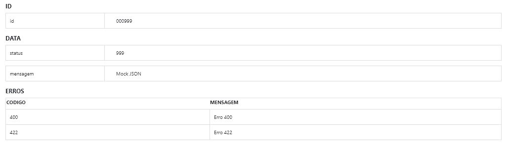

# JSON para Página HTML
Converte JSON para Página HTML. Busca facilitar a apresentação de um arquivo JSON produzido por uma API

## JSON Enviado

```json

{
    "id": "000999",
    "data": {
        "status": "999",
        "mensagem": "Mock JSON"
    },
    "erros": [
        {
            "codigo": "400",
            "mensagem": "Erro 400"
        },
        {
            "codigo": "422",
            "teste": "Erro 422"
        }
    ]
}

```
## Resultado

# 
 
